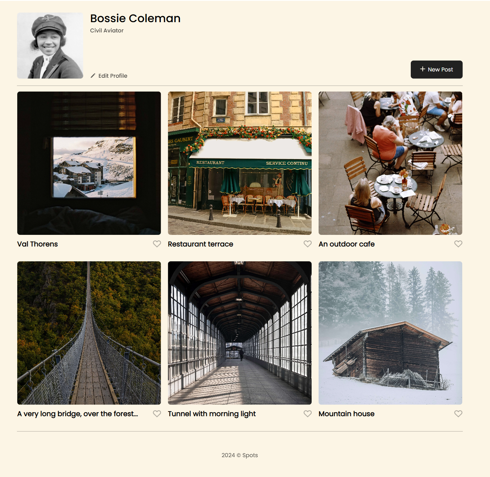
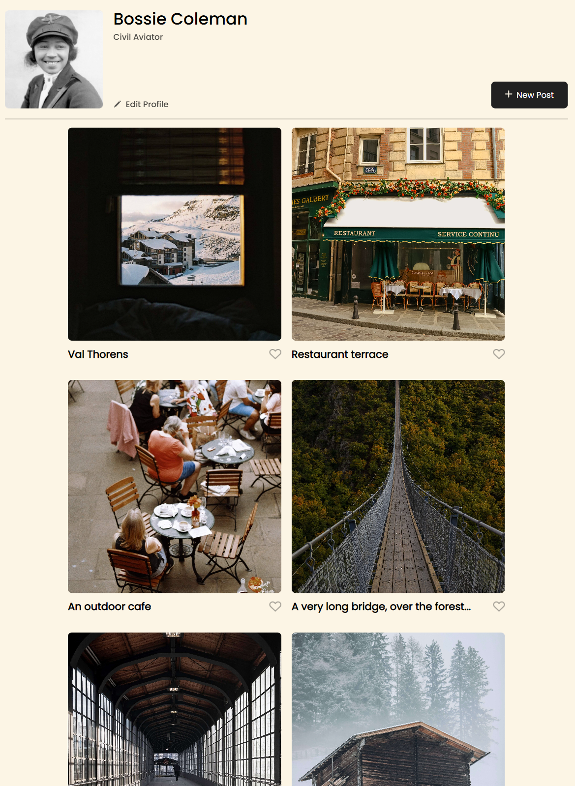
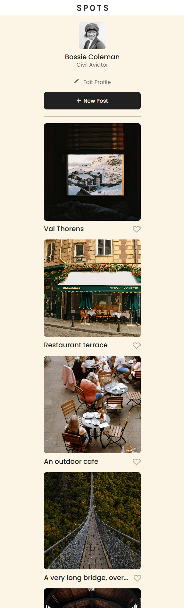

# Spots

An image sharing site.

## Description

This is a website application where people can update their profile and upload pictures and share them in a gallery set up.

## Technologies used

- HTML
- CSS
- Responsive design

## Images

## Deployment Link

[Spots](https://raycodes27.github.io/se_project_spots/)

## Project Pitch Video
 
You may take a look a the video[this video](https://drive.google.com/file/d/18IyE8E2ruaReNuwkjLFZhNkTi6nharNH/view?usp=sharing), here I describe the project and also things a learned.
